# Xcode配置OpenGL

## 1. 什么是GLFW

Graphics Library Framework（图形库框架），可以让我们通过其封装好的 通用API 来正确创建 OpenGL context（上下文） 并显示出一个简单的 窗口。

如果没有这个跨平台工具，那么我们在 windows 上创建 OpenGL窗口 时需要调用显卡中提供的 windows 使用的 API，而在 Mac 上创建窗口时需要 MacOS 的 API。


## 2. 获取GLFW

[从官网上下载GLFW macOS下64位二进制文件](https://www.glfw.org/download.html)

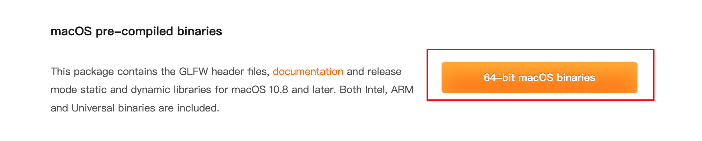

## 3. 什么是GLAD

因为 OpenGL 只是一个标准/规范，驱动开发商针对不同显卡有不同的具体实现，导致 OpenGL 驱动版本过于庞杂，**大多数函数的位置都无法在编译时确定下来，需要在运行时查询。** 因此开发者需要在**运行时获取函数地址并将其保存在一个函数指针中供以后使用。**

这里来看一个 LearnOpenGL CN 中所举的 Windows 下获取函数地址的例子：

```c++
// 定义函数原型
typedef void (*GL_GENBUFFERS) (GLsizei, GLuint*);
// 找到正确的函数并赋值给函数指针
GL_GENBUFFERS glGenBuffers  = (GL_GENBUFFERS)wglGetProcAddress("glGenBuffers");
// 现在函数可以被正常调用了
GLuint buffer;
glGenBuffers(1, &buffer);

```

对于开发人员而言，每使用一个函数就要经历这样的寻址过程无疑是极其痛苦的，因此需要通过 GLAD 库加载所有OpenGL函数指针，来简化使用函数的流程。


## 4. 获取 GLAD

打开 GLAD 的[在线服务](https://glad.dav1d.de/)：

+ 将 Language 设置为 C/C++；
+ 在 API 选项中，选择 3.3 以上的 OpenGL(gl)版本（更新的版本也能用）；
+ 之后将 模式(Profile) 设置为Core。
  + Compatibility 兼容旧版本，包含低版本中的 API 。
  + Core 只包含当前版本必须支持的 API ，不考虑向下兼容旧版本，更为轻巧。
+ 选中 `生成加载器(Generate a loader)` 选项。
+ 可以先（暂时）忽略 `扩展(Extensions)` 中的内容。
+ 点击 `生成(Generate)` 按钮来生成库文件。

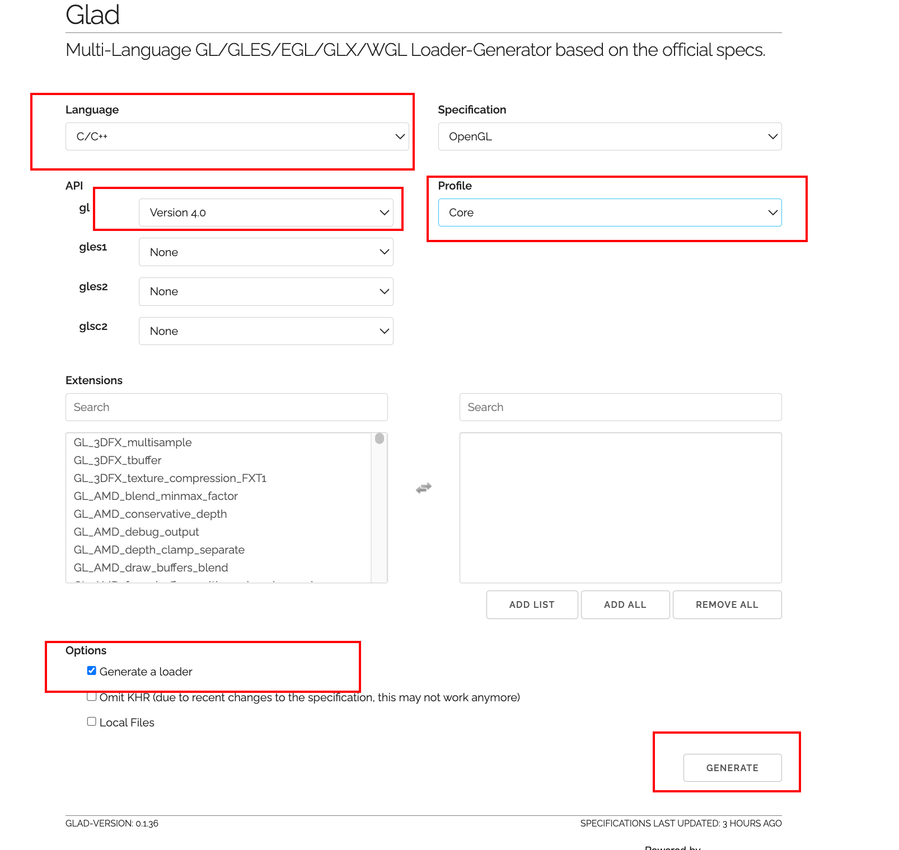

## 5. 最后的下载结果

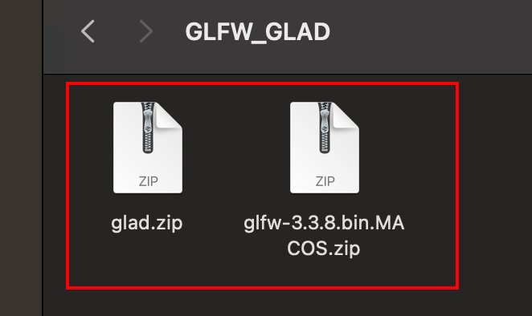


## 6. 在 Xcode 中配置下载好的 GLFW 和 GLAD

### 6.1 创建

1. 在XCode中创建C++项目

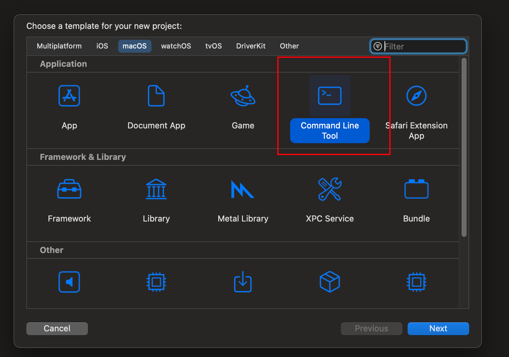

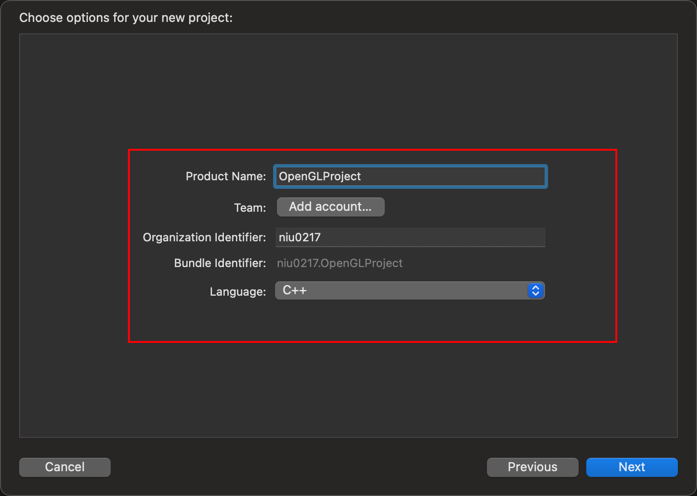

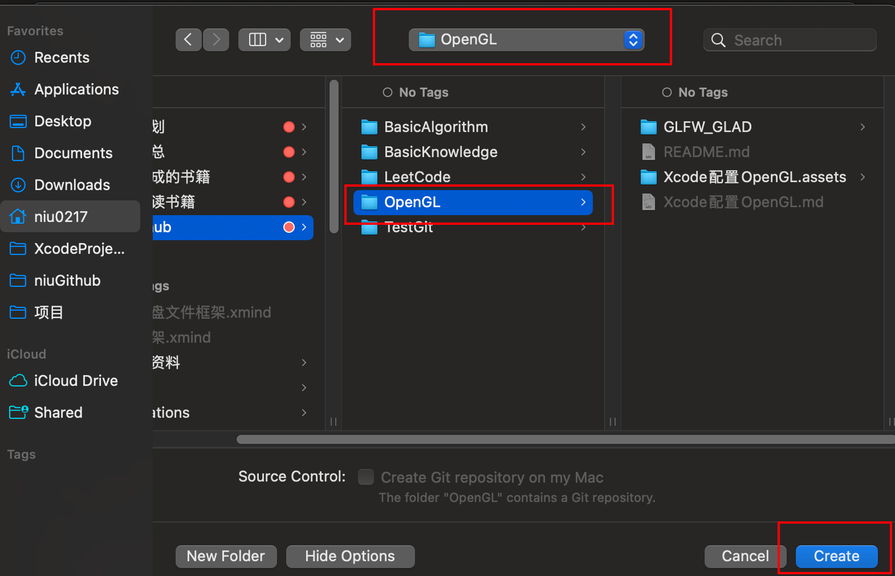

2. 设置头文件路径

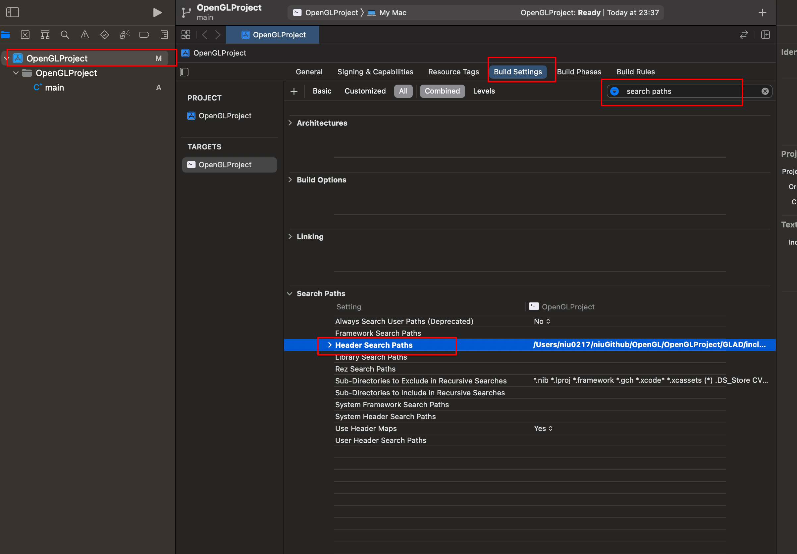

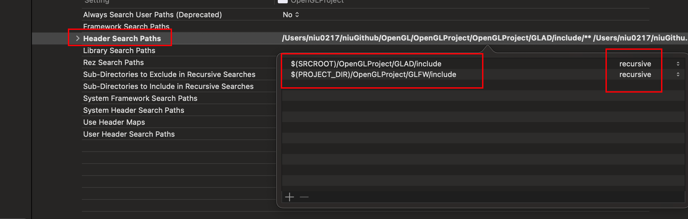

<font color=red>**注释：**</font>（详细参数配置看Xcode Search Paths 选项配置.md）

3. main.cpp中添加代码

```c++
#include <glad/glad.h>
#include <GLFW/glfw3.h>
```

点击Build创建成功则说明成功。

4. 根据下图顺序查看三个文件是否分别被添加进黄框所示部分，即可核验是否成功链接（Link）添加的文件 `libglfw3.a` 、`libglfw3.dylib`（静态库、动态库两者添加其一即可），以及 `glad.c` 是否参与编译：

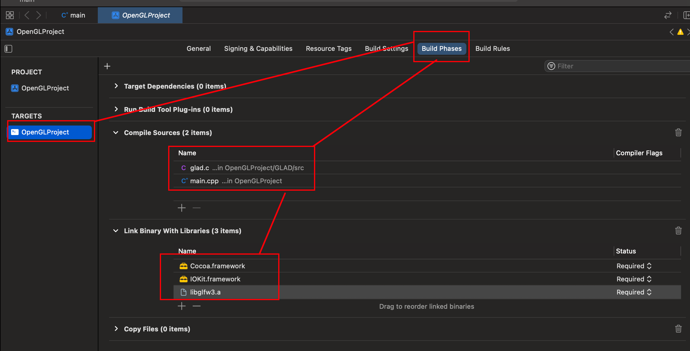

5. 检测是否配置成功

将下面的代码复制到 main.cpp 中并运行，如果能弹出一个墨绿色的窗口即证明配置成功。

```c++
#include <glad/glad.h>
#include <GLFW/glfw3.h>
#include <iostream>

// 对窗口注册一个回调函数(Callback Function)，它会在每次窗口大小被调整的时候被调用。
// 参数：window - 被改变大小的窗口，width、height-窗口的新维度。
void framebuffer_size_callback(GLFWwindow* window, int width, int height)
{
    // 改变视口大小的函数
    glViewport(0, 0, width, height);
}

// 实现输入控制的函数
void processInput(GLFWwindow *window)
{
    // glfwGetKey两个参数：窗口，按键
    // 没有被按下返回 GLFW_PRESS
    std::cout << "是否点击ESC?" << std::endl;
    std::cout << glfwGetKey(window, GLFW_KEY_ESCAPE) << std::endl;
    if(glfwGetKey(window, GLFW_KEY_ESCAPE) == GLFW_PRESS)
        // 被按下则将 WindowShouldClose 属性置为 true
        // 以便于关闭 渲染循环
        glfwSetWindowShouldClose(window, true);
}

int main()
{
    glfwInit(); // 初始化GLFW
    // glfwWindowHint函数的第一个参数代表选项的名称
    // 第二个参数接受一个整型，用来设置这个选项的值
    
    // 将主版本号(Major)和次版本号(Minor)都设为3
    glfwWindowHint(GLFW_CONTEXT_VERSION_MAJOR, 3);
    glfwWindowHint(GLFW_CONTEXT_VERSION_MINOR, 3);
    // 使用的是核心模式(Core-profile)
    glfwWindowHint(GLFW_OPENGL_PROFILE, GLFW_OPENGL_CORE_PROFILE);
    glfwWindowHint(GLFW_OPENGL_FORWARD_COMPAT, GL_TRUE);

    // 参数依次为：宽、高、窗口的名称,显示器用于全屏模式，设为NULL是为窗口
    // 窗口的上下文为共享资源，NULL为不共享资源
    GLFWwindow* window = glfwCreateWindow(800, 600, "FirstWindow", NULL, NULL);
    if (window == NULL)
    {
        std::cout << "Failed to create GLFW window" << std::endl;
        // 释放空间，防止内存溢出
        glfwTerminate();
        return -1;
    }
    
    // 创建完毕之后，需要让window的context成为当前线程的current context
    glfwMakeContextCurrent(window);
    
    // glfwGetProcAddress是glfw提供的用来加载 系统相关的OpenGL函数指针地址 的函数
    // 用gladLoadGLLoader函数根据使用者的系统定义了正确的函数
    if (!gladLoadGLLoader((GLADloadproc)glfwGetProcAddress))
    {
        std::cout << "Failed to initialize GLAD" << std::endl;
        return -1;
    }
    
    // 告诉OpenGL渲染窗口的尺寸大小，即视口(Viewport)
    // 这样OpenGL才只能知道怎样根据窗口大小显示数据和坐标
    // 调用glViewport函数来设置窗口的维度(Dimension)
    // 前两个参数控制窗口左下角的位置。第三个和第四个参数控制渲染窗口的宽度和高度（像素）
    glViewport(0, 0, 800, 600);
    
    // 窗口大小改变时视口也要随之改变，这通过对窗口注册 framebuffer_size_callback 实现。
    // 它会在每次窗口大小被调整时调用
    glfwSetFramebufferSizeCallback(window, framebuffer_size_callback);
    
    /* 渲染循环(Render Loop) */
    // glfwWindowShouldClose 检查一次GLFW是否被要求退出
    // 为true时渲染循环结束
    while(!glfwWindowShouldClose(window))
    {
        // 监测键盘输入
        processInput(window);
        
        /* 渲染 */
        // 状态设置函数，设置清空屏幕所用的颜色
        glClearColor(0.2f, 0.3f, 0.3f, 1.0f);
        // 状态使用函数，使用设定好的颜色来清除旧的颜色缓冲
        glClear(GL_COLOR_BUFFER_BIT);
        
        // 上面两种函数起到的作用也可以用 glClearBufferfv 来现实
        /*GLfloat color[] = {0.2, 0.3, 0.3, 1.0};
        glClearBufferfv(GL_COLOR, 0, color);*/

        // glfwSwapBuffers 交换颜色缓冲，用来绘制并作为输出显示在屏幕
        glfwSwapBuffers(window);
        // glfwPollEvents 检查是否有触发事件
        glfwPollEvents();
    }
    
    glfwTerminate();
    
    return 0;
}

```

### 6.2 遇到的问题

**问题一：编译的时候出现以下错误**

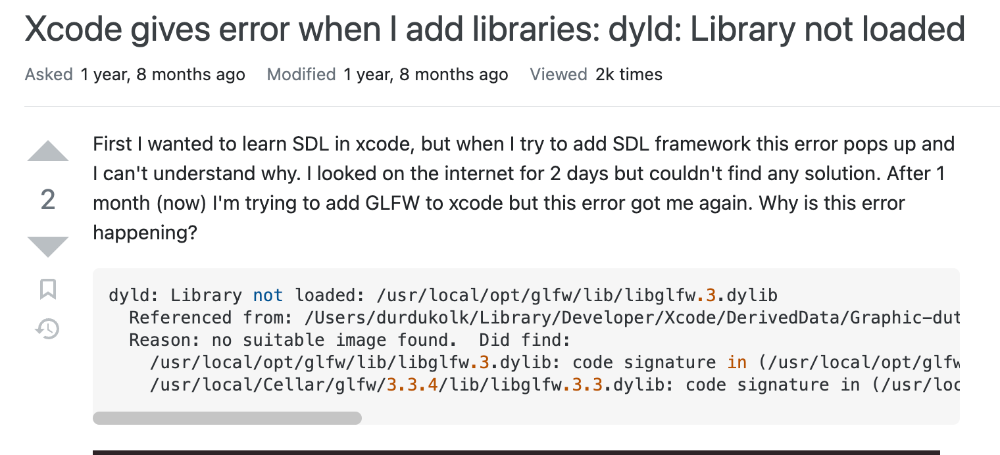

**解决方法：**

First you need to open "Enable hardened runtime" in section Signing in the project file.

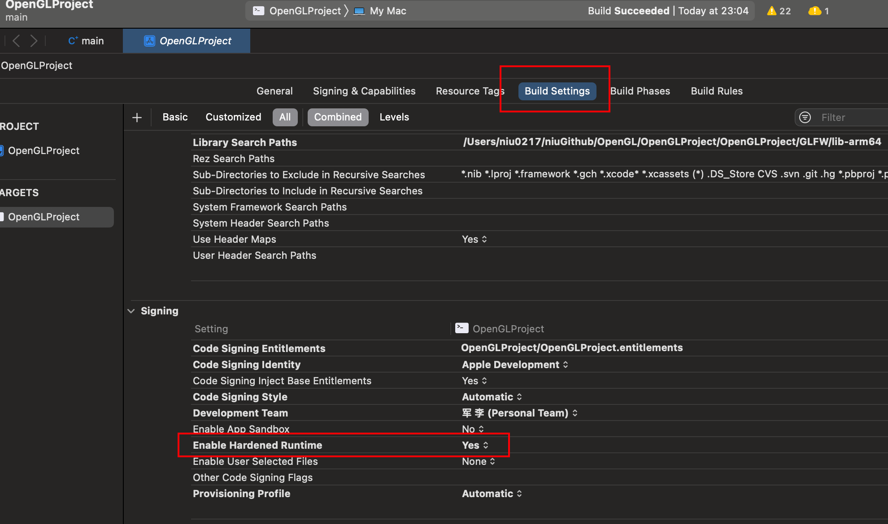

And need the check "Disable Library Validation" at product menu.

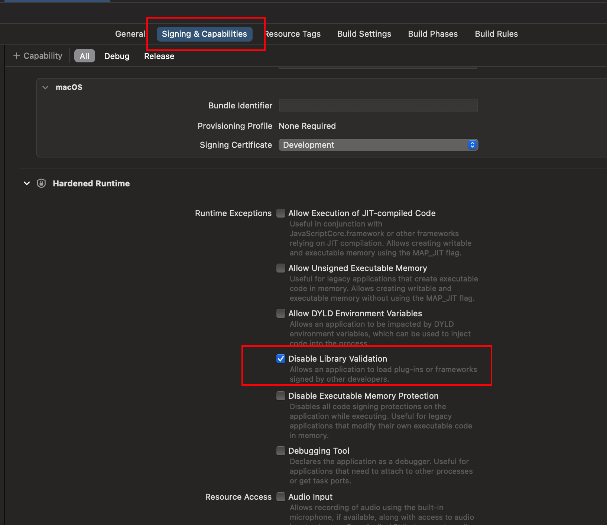


